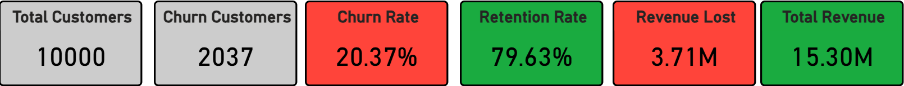
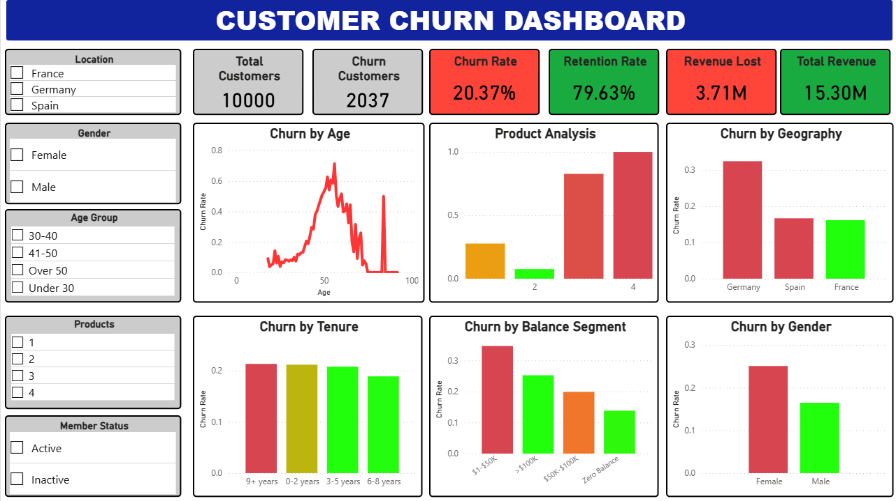
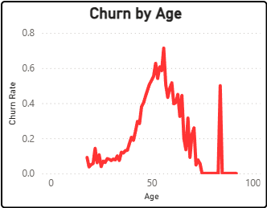
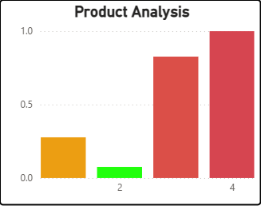
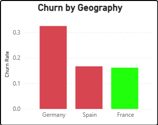
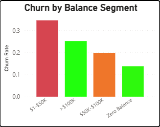
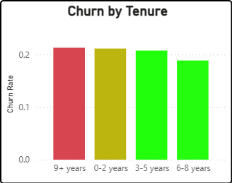
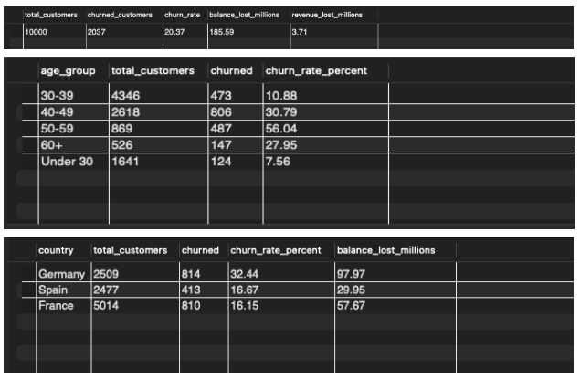

# Bank Customer Churn Analysis

**Technologies:** MySQL, Power BI, DAX  
**Project Date:** February 2026  
**Industry:** Banking & Financial Services

---

## Project Overview

Comprehensive data analysis identifying customer churn patterns and quantifying $3.7M in annual revenue losses. This project analyzes 10,000 customer records to uncover critical retention issues and provides executive-ready recommendations with measurable financial impact.

**Business Impact:** 20.37% churn rate (63% above industry standard) affecting 2,037 customers and $185.6M in account balances.




---

## Business Problem

The bank is experiencing an alarming customer churn rate of 20.37%, significantly above the 10-15% industry benchmark. This translates to substantial financial losses:

- **2,037 customers lost annually**
- **$185.6M in account balances lost**
- **$3.7M in annual recurring revenue lost**
- **$18.5M in customer lifetime value lost**

**Key Questions Analyzed:**
1. Which customer segments have the highest churn rates?
2. What is the financial impact on revenue and profitability?
3. Which factors are the strongest predictors of churn?
4. What retention strategies should be prioritized?

---

## Data Source

**Dataset:** Bank Customer Churn Prediction  
**Source:** [Kaggle](https://www.kaggle.com/datasets/shantanudhakadd/bank-customer-churn-prediction)  
**Records:** 10,000 customer records  
**Features:** 14 variables

**Key Variables:**
- Demographics: Age, Gender, Geography (France, Germany, Spain)
- Account Info: Credit Score, Balance, Tenure
- Product Usage: Number of Products, Active Member Status, Credit Card Ownership
- Target: Exited (0 = Retained, 1 = Churned)

---

## Dashboard

Interactive Power BI dashboard with comprehensive churn analysis across multiple dimensions.

**Dashboard Features:**
- Real-time KPI monitoring (churn rate, revenue impact, customer counts)
- 7 interactive visualizations analyzing different churn dimensions
- Dynamic filters (Geography, Age Group, Gender, Products, Member Status)
- Drill-down capabilities for detailed segment analysis




**Dashboard Pages:**
1. **Executive Overview** - Key metrics and overall churn rate
2. **Segment Analysis** - Demographics and geographic breakdown
3. **Product & Engagement** - Product performance and customer activity

---

## Key Findings

### Critical Findings - Immediate Action Required

#### 1. Age Cliff at 40 
**Status: CRITICAL**

**The Problem:**
- Customers under 40: 7-12% churn rate
- Customers over 40: 33-45% churn rate
- **Churn rate TRIPLES after age 40**

**Financial Impact:**
- $2.44M in annual revenue lost (66% of total churn impact)
- Losing high-value customers in their prime earning years
- Higher average balances than younger customers




**Recommended Actions:**
- Launch "40+ Retention Program" with premium services
- Assign dedicated relationship managers to high-balance 40+ customers
- Implement competitive rate matching for this segment

**Projected Impact:** Reducing 40+ churn to under-40 levels could save **$1.8M annually**

---

#### 2. Product 4 Crisis 
**Status: EMERGENCY**

**The Problem:**
- **100% churn rate** among Product 4 customers
- Small customer base (~3%) but complete product failure
- Not a retention issue - this is a product failure




**Recommended Actions:**
- **DISCONTINUE Product 4 immediately** or conduct emergency audit
- Contact all existing Product 4 customers proactively
- Migrate customers to Product 2 (optimal configuration)

**Estimated Savings:** $50K-$100K annually

---

#### 3. German Market Collapse 
**Status: URGENT**

**The Problem:**
- Germany has **highest churn rate** across all geographies
- Represents 25% of customer base
- $98M in balance losses (53% of total)
- $1.96M in annual revenue lost (53% of total)




**Recommended Actions:**
- Deploy German Market Task Force for investigation
- Conduct competitive analysis in German banking market
- Implement Germany-specific retention offers
- Exit interviews with churned German customers

**Projected Impact:** Reducing German churn to average could save **$1.5M+ annually**

---

#### 4. High Balance Customer Exodus 
**Status: CRITICAL**

**The Problem:**
- High-balance customers leaving at elevated rates
- Most profitable segment moving to competitors
- Likely seeking better rates or premium services




**Recommended Actions:**
- Implement premium services tier for accounts > $100K
- Competitive rate matching for top-tier accounts
- Concierge banking services and priority support

**Estimated Impact:** Retaining top 20% of high-balance churned customers = **$500K+ annual revenue**

---

### Positive Findings

#### Product 2 Sweet Spot 
- Product 2 configuration has **LOWEST churn rate** across all product counts
- This is the optimal customer setup
- **Action:** Promote cross-sell campaigns to reach 2-product configuration

#### Young Customer Loyalty 
- Customers under 40 show excellent retention (7-12% churn)
- Current approach is **working** for this demographic
- **Action:** Maintain current service model

---

### Concerning Findings

#### Tenure Doesn't Matter 
- Churn rate is ~20% regardless of customer tenure
- 10-year customers leave at same rate as new customers
- Indicates **systemic service issues**, not onboarding problems




**Implication:** Need comprehensive loyalty program overhaul, not just improved onboarding

---

## SQL Analysis

### Sample Queries

**Overall Churn Metrics**
```sql
-- Calculate overall churn rate and financial impact
SELECT 
    COUNT(*) as total_customers,
    SUM(CASE WHEN Exited = 1 THEN 1 ELSE 0 END) as churned_customers,
    ROUND(SUM(CASE WHEN Exited = 1 THEN 1 ELSE 0 END) * 100.0 / COUNT(*), 2) as churn_rate,
    ROUND(SUM(CASE WHEN Exited = 1 THEN Balance ELSE 0 END) / 1000000, 2) as balance_lost_millions,
    ROUND(SUM(CASE WHEN Exited = 1 THEN Balance ELSE 0 END) * 0.02 / 1000000, 2) as revenue_lost_millions
FROM churn_modelling;
```

**Age Group Analysis**
```sql
-- Churn rate by age groups
SELECT 
    CASE 
        WHEN Age < 30 THEN 'Under 30'
        WHEN Age >= 30 AND Age < 40 THEN '30-39'
        WHEN Age >= 40 AND Age < 50 THEN '40-49'
        WHEN Age >= 50 AND Age < 60 THEN '50-59'
        ELSE '60+'
    END as age_group,
    COUNT(*) as total_customers,
    SUM(CASE WHEN Exited = 1 THEN 1 ELSE 0 END) as churned,
    ROUND(SUM(CASE WHEN Exited = 1 THEN 1 ELSE 0 END) * 100.0 / COUNT(*), 2) as churn_rate_percent
FROM churn_modelling
GROUP BY age_group
ORDER BY age_group;
```

**Geographic Analysis**
```sql
-- Churn rate and financial impact by geography
SELECT 
    Geography as country,
    COUNT(*) as total_customers,
    SUM(CASE WHEN Exited = 1 THEN 1 ELSE 0 END) as churned,
    ROUND(SUM(CASE WHEN Exited = 1 THEN 1 ELSE 0 END) * 100.0 / COUNT(*), 2) as churn_rate_percent,
    ROUND(SUM(CASE WHEN Exited = 1 THEN Balance ELSE 0 END) / 1000000, 2) as balance_lost_millions
FROM churn_modelling
GROUP BY Geography
ORDER BY churn_rate_percent DESC;
```




---

## Strategic Recommendations

### Phase 1: Immediate Actions (Month 1)
**Projected Impact: $3.5M+ in potential annual revenue preservation**

1. **Emergency Product 4 Review**
   - Halt all Product 4 cross-sells immediately
   - Contact existing Product 4 customers proactively
   - Migrate to Product 2 configuration

2. **Launch "40+ Retention Program"**
   - Premium services for customers age 40+
   - Dedicated relationship managers for high-balance accounts
   - Enhanced rates/benefits and competitive rate matching

3. **German Market Task Force**
   - Investigate German-specific churn drivers
   - Competitive analysis in German banking market
   - Germany-specific retention offers

---

### Phase 2: Short-Term Initiatives (Months 2-3)
**Projected Impact: $1.5M+ in potential annual revenue**

1. Product 2 cross-sell campaign
2. High-balance customer care program (>$100K accounts)
3. Women's banking initiative
4. Product 3 quality audit

---

### Phase 3: Long-Term Strategy (Months 4-6)
**Projected Impact: $500K+ in potential annual revenue**

1. Customer loyalty program overhaul
2. Life-stage banking products
3. Geographic customization

---

## Results & Impact

### Financial Opportunity

**If churn is reduced by 5 percentage points (from 20.37% to 15.37%):**
- Save 500 customers annually
- Preserve $45.6M in account balances
- Generate **$911K in additional annual revenue**
- Save $200K in re-acquisition costs
- Build foundation for sustainable growth

**Total addressable opportunity: $1.1M+ in annual revenue recovery**

---

### Success Metrics (6-Month Targets)

**Primary KPIs:**
- Overall churn rate: Reduce from 20.4% to **15%**
- 40+ age group churn: Reduce from 40% to **25%**
- German market churn: Reduce from 32% to **22%**
- Product 4: Complete discontinuation or <10% churn
- High balance customer retention: Increase to **90%+**

**Secondary KPIs:**
- Product 2 adoption rate (target: 45% of customer base)
- 40+ customer satisfaction scores (target: 85%+)
- German market Net Promoter Score (target: >50)
- Revenue per customer (target: $1,600+)

---

## Technical Approach

### Data Cleaning & Preparation
1. Data quality assessment - validated 10,000 records with no missing values
2. Feature engineering - created age groups and balance segments
3. Data validation - verified calculations and segment totals

### Analysis Methodology
**8-Phase Systematic Approach:**
1. Initial data profiling
2. Exploratory data analysis
3. Segment identification
4. Financial impact quantification
5. Root cause analysis
6. Statistical validation
7. Visualization development
8. Executive reporting

---

## Skills Demonstrated

**Technical Skills:**
- Advanced SQL querying (CASE statements, aggregations, GROUP BY)
- Data cleaning and quality assessment
- Power BI dashboard design and development
- DAX formulas for calculated columns and measures
- Financial modeling and KPI calculation

**Business Skills:**
- Customer segmentation and cohort analysis
- Revenue impact quantification
- Executive-level business communication
- Strategic recommendation development
- Stakeholder presentation and reporting

**Analytical Skills:**
- Exploratory data analysis (EDA)
- Pattern recognition and trend analysis
- Root cause identification
- Statistical validation
- Data-driven decision making

---

## Tools & Technologies

**Data Analysis:**
- MySQL 8.0
- MySQL Workbench

**Visualization:**
- Power BI Desktop
- DAX (Data Analysis Expressions)

**Documentation:**
- Microsoft Word
- Markdown

---

## Key Learnings

### Business Insights
- Customer churn is rarely a single issue - requires multi-dimensional analysis
- Age is a stronger predictor of churn than income or credit score
- Product configuration significantly impacts retention
- Geographic markets require localized strategies

### Technical Insights
- Systematic data profiling reveals hidden patterns
- Financial quantification drives executive action
- Interactive dashboards enable self-service analytics
- Clear communication bridges technical and business audiences

---

## Connect

**LinkedIn:** [linkedin.com/in/phuc-le-6145aa375](https://www.linkedin.com/in/phuc-le-6145aa375)  
**Email:** le.lukec@gmail.com  
**Portfolio:** [GitHub](https://github.com/lukele1/Data--Analytics-Portfolio)

---

**[← Back to Portfolio](../)**
